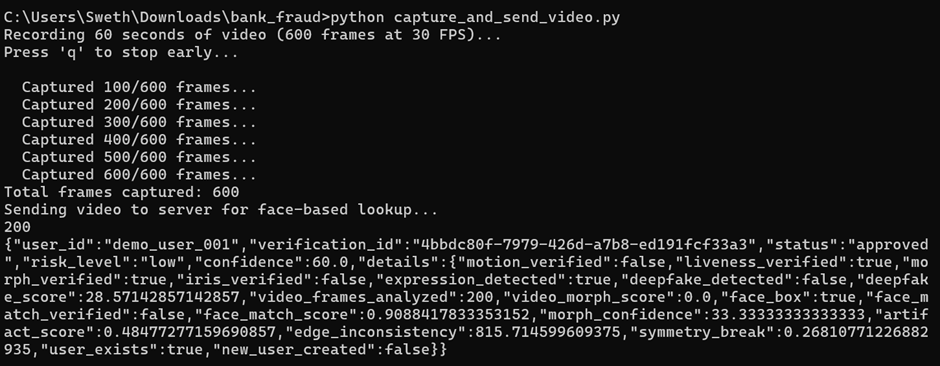

# Adaptive Multi-Layer Identity Verification System
## PSB Hackathon Series 2026 - Cybersecurity & Fraud Domain

### Project Overview
An advanced identity verification system that combines multiple verification layers to prevent fraud in banking KYC and account recovery processes.

### Key Features
1. **Live Motion Check** - Face movement + gyroscope/accelerometer verification
2. **ROI-based rPPG Verification** - Blood flow pattern detection to prevent deepfakes
3. **Frequency-Domain Morph Detection** - Fourier Transform-based morph attack detection
4. **Iris Recognition** - Fallback verification for edge cases (identical twins)
5. **Hardware-Bound Trust Token Graph** - Session comparison against stored trust profile

### System Architecture

```
Identity Verification System
├── Motion Verification Layer
│   ├── Face Detection
│   └── Motion Tracking (Gyroscope/Accelerometer)
├── Liveness Detection Layer
│   ├── rPPG Verification
│   └── Expression Analysis
├── Biometric Analysis Layer
│   ├── Morph Detection (Fourier)
│   └── Face Quality Assessment
├── Iris Recognition Layer
│   └── Iris Pattern Matching
└── Trust Token Management
    ├── Token Generation
    └── Profile Comparison
```

### Technology Stack
- **Backend**: FastAPI, Flask
- **Computer Vision**: OpenCV, MediaPipe
- **Deep Learning**: TensorFlow, PyTorch
- **Database**: SQLAlchemy with SQLite/PostgreSQL
- **Signal Processing**: NumPy, SciPy
- **Face Recognition**: dlib

### Installation
```bash
pip install -r requirements.txt
python src/main.py
```

### API Endpoints
- `POST /api/verify/kyc` - KYC verification
- `POST /api/verify/liveness` - Liveness detection
- `POST /api/verify/morph-detection` - Morph attack detection
- `POST /api/verify/iris` - Iris recognition
- `POST /api/token/generate` - Generate trust token
- `GET /api/token/validate` - Validate trust token
- `GET /api/demo/users` - List seeded demo users for prototype testing

> Sample seeded demo IDs: `demo_user_001`, `demo_user_002`

###Screenshots




